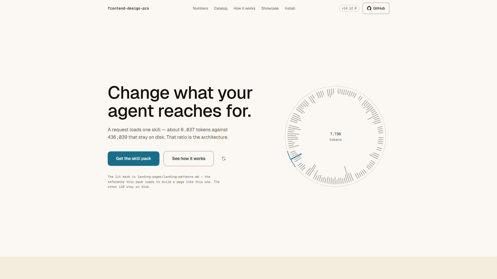

<div align="center">


**Taste you can put in CI.**
**61 machine-checked constraints, 11 release gates, and an agent that stops reaching for Inter.**

[](https://github.com/Krishna-Modi12/frontend-design-pro/releases)
[](https://github.com/Krishna-Modi12/frontend-design-pro/actions/workflows/ci.yml)
[](LICENSE)
[](https://github.com/Krishna-Modi12/frontend-design-pro/stargazers)

[](https://krishna-modi12.github.io/frontend-design-pro/)

**[Live site](https://krishna-modi12.github.io/frontend-design-pro/)** · **[Install](#install-in-30-seconds)** · **[Skills](#the-19-skills)** · **[Architecture](#architecture--registry--lazy-loading)** · **[Demos](#demos)** · **[Verification](#verification)** · **[Docs](#docs)**

</div>

---

A machine-enforced frontend UI/UX skill pack for AI coding agents. Most prompt packs *tell* an agent what good UI looks like. This one proves it: every example compiles under `tsc --strict`, passes AST analysis, and ships with a test — and no archive can be built unless all of that is green.

> [!NOTE]
> **The whole claim is that it is verified rather than asserted.** Every number below is recomputed from the filesystem by a release-blocking gate. When a document and a gate disagree, the gate is right.

<div align="center">

| Skills | References | Depth | Always loaded | Per request | Constraints | Gates |
|:---:|:---:|:---:|:---:|:---:|:---:|:---:|
| **19** | **119** | **436,284 tokens** | **2,154 tokens** | **6,042–7,956** | **61** | **11** |

</div>

<div align="center">


<sub>Every figure on that banner is read from <code>check_figures.py --truth</code> at generation time, and CI fails if the committed file drifts from it.</sub>

</div>

The bar on the right is drawn to scale. That sliver is what a request costs; the rest is material the agent never reads unless it asks for it. **That ratio is the whole architecture** — [how it works](#architecture--registry--lazy-loading).

---

## What it builds

Four projects generated by the routing itself, captured from a real browser at 1920×1080 — not staged, not retouched.

<div align="center">
<table>
<tr>
<td width="50%" valign="top">
<a href="https://krishna-modi12.github.io/frontend-design-pro/landing-page/"></a>
<br><b><a href="https://krishna-modi12.github.io/frontend-design-pro/landing-page/">Bellwether</a></b> · <a href="demo/landing-page/">source</a><br>
<sub>Runnable Next.js app. Near-black OKLCH at one hue, an accent split into a fill and a text weight, one scroll reveal and nothing else moving.</sub>
</td>
<td width="50%" valign="top">
<a href="https://krishna-modi12.github.io/frontend-design-pro/showcase/"></a>
<br><b><a href="https://krishna-modi12.github.io/frontend-design-pro/showcase/">Wavelet</a></b> · <a href="demo/showcase/">source</a><br>
<sub>Runnable Next.js app. React Three Fiber particle hero, asymmetric bento, working pricing toggle, RHF + Zod contact form.</sub>
</td>
</tr>
<tr>
<td width="50%" valign="top">
<a href="demo/dashboard/screenshot-full.png"></a>
<br><b>Ledgerline</b> · <a href="demo/dashboard/">source</a><br>
<sub>Sortable accounts table with all four states, a <code>next/dynamic</code> chart that reserves its height, tabular-nums KPI cards.</sub>
</td>
<td width="50%" valign="top">
<a href="demo/auth-form/screenshot-full.png"></a>
<br><b>Arclight</b> · <a href="demo/auth-form/">source</a><br>
<sub>React Hook Form + Zod, errors wired through <code>aria-describedby</code>, OAuth providers, and a jest-axe test.</sub>
</td>
</tr>
</table>
</div>

All four products are invented, and the two you can open say so on the page itself rather than in a source comment only a contributor would find. The prompt behind each one is in [docs/DEMO_PROMPTS.md](docs/DEMO_PROMPTS.md) — copy it into your own agent and compare what comes back. Full write-up: [Demos](#demos).

---

## Table of contents

- [What it builds](#what-it-builds)
- [What actually changes in your output](#what-actually-changes-in-your-output)
- [Spot the slop — four rounds](#spot-the-slop--four-rounds)
- [Install in 30 seconds](#install-in-30-seconds)
- [What this pack does on your machine](#what-this-pack-does-on-your-machine)
- [When it doesn't work](#when-it-doesnt-work)
- [The 19 skills](#the-19-skills)
- [Architecture — registry + lazy loading](#architecture--registry--lazy-loading)
- [Demos](#demos)
- [The pack, pointed at itself](#the-pack-pointed-at-itself)
- [Release history](#release-history)
- [Verification](#verification)
- [Issues & contributing](#issues--contributing)
- [Docs](#docs)

---

## What actually changes in your output

These are not style preferences. Each row below is a check that fails a build, with the constraint ID that enforces it. The illustration is a summary of the same rules — no fabricated screenshot of any real tool, just the left column of the table below rendered instead of listed.

<div align="center">

</div>

| What agents reach for by default | What this pack enforces | Enforced by |
|---|---|---|
| `Inter` / `Poppins` / `DM Sans` as the display face | A face with a point of view, system stack as fallback | `TYP-02` |
| Purple → pink → blue gradient | One accent, derived from the brand | `COL-03` |
| `bg-[#0F1419]`, raw hex everywhere | OKLCH tokens only | `COL-04`, `TOK-01` |
| `min-h-screen` | `min-h-[100dvh]` — the mobile viewport is not the screen | `RES-03` |
| `setTimeout(() => setLoading(false), 1500)` | Loading state driven by real async, never faked | `DELAY-01-AST` |
| `ease-in` on an entrance | Ease-out to arrive, ease-in to leave | `MOTION-02` |
| A `scroll` listener calling `setState` | Re-render per frame is a bug, not a technique | `ANI-04` |
| "John Doe", "$99.99", "Elevate your workflow", "Acme" | Names and prices somebody could have, copy somebody wrote, a brand that fits the sector | `SLOP-01`, `SLOP-02`, `SLOP-05` |
| `aria-label` mentioned in a comment | Real JSX attributes, or it doesn't count | `A11Y-01` |
| Equal-height card grid, 3 across | Asymmetry, hierarchy, one showpiece per viewport | anti-slop wall |
| A component with only a happy path | All four states — loading, empty, error, success | `STA-01`, `STA-02` |

The full list of 61 constraints lives in [`core/validate-checklist.md`](core/validate-checklist.md). Ten deliberate **anti-examples** (`catalog/*/examples/bad-*.tsx`) exist to prove the checks fire — the suite asserts they fail.

### Run them against your own code

The same checkers the gate chain uses take a path. From the directory the pack installed into:

```bash
npm install typescript @types/react @types/react-dom   # once — the checkers need a compiler
python scripts/test_constraints.py --dir ../../../components --component
python scripts/test_constraints.py --dir ../../../app                    # pages: no flag
```

**`--component` is the flag that matters.** Eight of the 44 regex constraints describe a *page* — a declared font, a default export, landmark elements, all four states, breakpoints, a skip link. They are right about a screen and wrong about a status pill, so pointing the suite at a well-factored `components/` directory without the flag produces a wall of failures that are all artefacts of scope. The flag drops those eight and names them in the output; the remaining 35 plus all 17 AST checks still apply. Without a compiler installed the AST half skips and says so rather than failing.

---

## Spot the slop — four rounds

Four snippets below. Every one of them compiles, renders, passes review, and ships. Every one of them fails a check in this pack.

Read each, decide what is wrong, then expand. No score is kept and nothing is watching — the point is whether the answers feel obvious once you see them, because that is what the agent is being held to on every file it writes.

### Round 1

```tsx
useEffect(() => {
  setTimeout(() => setLoading(false), 1500);
}, []);
```

<details>
<summary><b>What fails, and which check catches it?</b></summary>

<br>

**`DELAY-01-AST` — no `setTimeout` gating state inside a mount `useEffect`.**

This is a loading state that is not loading anything. It renders a skeleton for exactly 1.5 seconds whether the data arrives in 50ms or never arrives at all, and because it always resolves, the error branch underneath it has never once executed. Agents reach for it constantly, because it makes a demo *look* right in a screenshot.

The check is an AST rule rather than a regex on purpose: it looks for a `setTimeout` that gates a state setter inside a `useEffect` with an empty dependency array. A `setTimeout` used for a debounce, a toast dismissal or a focus deferral is untouched.

**The fix is not a longer timeout.** Drive the state from the real async boundary and let the error path be reachable — which is also what `STA-01`/`STA-02` are asking for when they demand all four states.

</details>

### Round 2

```tsx
<h2 style={{ fontFamily: "Inter" }}>Elevate your workflow</h2>
<p>Trusted by teams at Acme and Cloudly</p>
<Avatar name="John Doe" plan="$99.99/mo" />
```

<details>
<summary><b>Four separate checks fail here. How many can you name?</b></summary>

<br>

| Check | What it catches |
|---|---|
| `TYP-02` | `Inter` as the display face. Not a bad typeface — the default one, chosen by nobody. |
| `SLOP-02` | `"Elevate your workflow"`. Also *Seamless*, *Unleash*, *Revolutionize*. |
| `SLOP-01` | `"John Doe"` and `$99.99` — the name nobody is called and the price nothing costs. |
| `SLOP-05` | `Acme`, `Cloudly`. The brand a model reaches for when it was not given one. |

`SLOP-05` is the newest of the four, and it exists because of a miss rather than a design. The anti-slop wall had named those brand names since the beginning, and **nothing read that half of it** — so two gold examples shipped `Acme Inc.` and a reference file taught the pattern seventeen times, inside a worked example built to be copied. The wall was right; it was just not wired to anything.

That is the argument for machine-checking prose rules in general: a wall nobody enforces is decoration, and the parts of it that go unenforced are invisible precisely because everything looks green.

**The rule names one brand this repo's own showcase demo used to carry: `Nexus`.** The suite failed it, and rather than quietly exempt ourselves that failure shipped as a declared waiver with its reason attached, printed in the summary line on every single run. The demo is renamed now and the waiver is deleted: `GRANDFATHERED` is empty, and `grandfathered_check()` fails the suite if an entry comes back while this paragraph still says it is empty. Ship the rule, waive the instance, print the waiver, close it — [see for yourself](demo/showcase/README.md).

Every item here is on that wall in the root [`SKILL.md`](SKILL.md) — the one file that is always loaded — which is why this class of defect is caught before the code exists rather than after.

</details>

### Round 3

```tsx
{/* aria-label added for screen readers */}
<button onClick={onClose}>
  <XIcon />
</button>
```

<details>
<summary><b>The comment is the bug. Why?</b></summary>

<br>

**`A11Y-01` — `aria-*` must exist as real JSX attributes, not comment décor.**

This is the single most common way accessibility gets *claimed* rather than *shipped*. Someone asked for a label, the model wrote a comment saying it added one, and the rendered button is an unlabelled icon that a screen reader announces as "button". The comment makes it worse than no comment, because it stops the next reader from checking.

It is worth knowing why this rule exists at all: a checklist that says "add ARIA labels" is satisfiable by prose. A check that parses the JSX is not.

```tsx
<button onClick={onClose} aria-label="Close dialog">
  <XIcon aria-hidden="true" />
</button>
```

</details>

### Round 4 — the hard one

```tsx
useEffect(() => {
  const onScroll = () => setOffset(window.scrollY * 0.5);
  window.addEventListener("scroll", onScroll);
  return () => window.removeEventListener("scroll", onScroll);
}, []);

<div
  className="transition-all duration-300 ease-in"
  style={{ transform: `translateY(${offset}px)` }}
>
```

<details>
<summary><b>Four checks fail. One of them is genuinely subtle, and one is easy to forget entirely.</b></summary>

<br>

**`ANI-04` — a `scroll` listener calling `setState` un-batched.** This runs a React re-render on every scroll frame to move one element. It is the parallax effect that makes a laptop fan audible. Throttled, debounced and rAF-driven handlers all pass; so does `IntersectionObserver`, which is what this actually wants.

**`PERF-04` — `transition-all` on a moving element.** It animates every animatable property including ones you never meant to touch, so a layout change elsewhere becomes an animation here. Name the properties instead.

**`MOTION-02` — no bare `ease-in` on an entrance.** This is the subtle one. `ease-in` starts slow and accelerates, so an element *entering* the screen creeps in and then lunges at its final position. Reverse it and the intuition is obvious: things arriving should decelerate (`ease-out`), things leaving should accelerate (`ease-in`). The rule is anchored to entrance and timing context — an exit-keyed `ease-in` is correct and passes.

**`MOTION-01` — motion with no `prefers-reduced-motion` path.** This is the one most people miss, because the page looks finished without it. There is animation here and no branch for the reader whose system asks for less of it — which for a vestibular disorder is not a preference setting, it is the difference between a usable page and a nauseating one. Every one of the four is a real failure; if you named three, this is the one you named last.

</details>

<br>

> **Found a snippet the pack misses?** [Open an issue with it →](https://github.com/Krishna-Modi12/frontend-design-pro/issues/new?title=Slop+the+pack+misses&body=%23%23+The+snippet%0A%0A%60%60%60tsx%0A%0A%60%60%60%0A%0A%23%23+What+is+wrong+with+it%0A%0A%0A%23%23+Which+of+the+11+gates+should+have+caught+it%0A%0A)
> Genuinely the most useful contribution there is — a defect nobody has written a check for is worth more than a check nobody needed.

---

## Install in 30 seconds

```bash
npx skills add Krishna-Modi12/frontend-design-pro
```

One command, no clone, no setup script. It detects every agent you have installed and wires the pack into each.

It installs as **one** skill, which is the shape this pack needs: the root `SKILL.md` router arrives with `core/` and all 19 `catalog/` beside it, so lazy loading still works. Verified against a clean directory — 19 of 19 registry rows and 6 of 6 declared core deps resolve inside the install.

> [!NOTE]
> This tracks `main`, not a release — may be ahead of the badge above. Want a pinned, gated build instead? **[Grab the release archive](https://github.com/Krishna-Modi12/frontend-design-pro/releases/latest)** (built only when all 11 gates pass). Don't pass `--full-depth` — it installs all 19 skills as competing peers instead of one router, which is the architecture this pack exists to avoid. `npx skills add … --list` should show one entry.

The installer sends anonymous install telemetry by default; `DISABLE_TELEMETRY=1 npx skills add …` opts out. That is the CLI's behaviour, not the pack's — see [what this pack does on your machine](#what-this-pack-does-on-your-machine).

<details>
<summary><b>Or install from the git tree / the gated archive</b></summary>

Run this from the root of the project you want the agent to work on:

```bash
git clone --depth 1 https://github.com/Krishna-Modi12/frontend-design-pro && bash frontend-design-pro/setup.sh
```

The clone directory is named `frontend-design-pro` on purpose — every adapter references `frontend-design-pro/SKILL.md` relative to your project root, so the path the installer writes is the path that exists. `setup.sh` then detects your agent and writes its native rules file.

**Prefer the gated archive over a git tree?** Every release attaches a `.skill` built only after all 11 gates pass. The tree on `main` is checked by CI, but the archive is the artifact that cannot exist while anything is red.

```bash
gh release download --repo Krishna-Modi12/frontend-design-pro --pattern '*.skill'
unzip frontend-design-pro-v*.skill -d ./   # pack lands at ./frontend-design-pro/
bash frontend-design-pro/setup.sh          # detects the agent, writes its native rules file
```

</details>

**Not sure, or using something not listed? Install the cross-agent file:**

```bash
bash frontend-design-pro/setup.sh agents   # writes AGENTS.md
```

`AGENTS.md` is an open specification governed by the Linux Foundation's Agentic AI Foundation, and roughly thirty agents read it — Codex, Cursor, Copilot, Windsurf, Aider, Continue, **Zed, Jules, Devin, Factory, Amp, OpenHands, JetBrains Junie, Roo Code**. One file, most of the field.

Ten adapters install automatically: `agents` · `cursor` · `copilot` · `cline` · `roo` · `zed` · `gemini` (CLI) · `windsurf` · `continue` · `aider`. Four are manual because no installer should write them — Claude Code (a user-level skills directory), ChatGPT (a web upload), Codex (an `AGENTS.md` your repo already owns), and anything unlisted.

`setup.sh --list` names every adapter, `setup.sh cursor` skips detection, `--dry-run` shows what it would write, and nothing is overwritten without `--force`. `setup.ps1` is the PowerShell port. The files it copies live in [`install/`](install/) if you would rather place them yourself.

### What this pack does on your machine

Short version: it's markdown and TypeScript files an agent *reads*, not executes — no build step, no network calls, no telemetry, no credentials read. The only thing that ever runs is `setup.sh`/`setup.ps1` (readable in full — `cp`, `mkdir`, `find`, no `eval`, no `curl`, no `sudo`), and it writes only adapter rules files, listed by `--dry-run` before anything is written. Full breakdown and the exact `grep` commands to verify it yourself: [SECURITY.md](SECURITY.md#what-this-pack-does-on-your-machine).

Then just ask for what you want, in plain language:

```
Build a pricing section for a developer tool. Dark mode, three tiers,
annual/monthly toggle. Not the usual three equal cards.
```

The agent matches your wording against the registry, loads **one** skill plus its dependencies, and builds. **No slash commands, no prefixes** — routing is on natural-language trigger keywords.

**Per-host setup for the manual hosts** (Claude Code, Claude Desktop, Cursor, ChatGPT Custom GPT, OpenAI API, GitHub Copilot, Gemini) — the exact steps and per-host caveats live in [docs/AGENT_COMPATIBILITY.md](docs/AGENT_COMPATIBILITY.md), which also covers Windsurf, Continue.dev, Aider and Codex CLI.

`SKILL.md` is self-contained, so no system-prompt setup is required. If your host supports a system prompt, [`AGENT_SYSTEM_PROMPT.md`](AGENT_SYSTEM_PROMPT.md) is a registry-native drop-in that makes the loading protocol and the validation contract explicit. Full guide: [docs/USAGE.md](docs/USAGE.md).

### When it doesn't work

Five symptoms, each one actually hit and diagnosed: routing looking generic (almost always `--full-depth`), a wall of constraint failures on a fine directory (missing `--component`), AST checks silently skipping (no TypeScript compiler on the path), a missing version stamp (the `npx skills add` route tracks `main`, not a release), and a documented figure disagreeing with what you counted. Full diagnosis and the fix for each: [docs/TROUBLESHOOTING.md](docs/TROUBLESHOOTING.md).

---

## The 19 skills

One skill loads per request. You never name it — the **Try saying** column is what actually routes there. Most specific wins: *"form validation"* goes to `forms`, not `react-components`.

### Building something new

| Skill | What it covers | Try saying |
|---|---|---|
| [`landing-pages`](catalog/landing-pages/SKILL.md) | Heroes, pricing, testimonials, bento grids, logo walls, comparison tables, FAQ, CTAs, footers — plus empty states and onboarding | *"Build a landing page for a CI tool. Dark, technical, no stock-photo energy."* |
| [`react-components`](catalog/react-components/SKILL.md) | One reusable component or a small family: button, card, modal, dropdown, tabs, accordion, tooltip, select, popover. shadcn/Radix, compound components, `forwardRef`, CVA | *"Build a Dialog with a compound API — Dialog.Root, Trigger, Content — that traps focus properly."* |
| [`forms`](catalog/forms/SKILL.md) | Anything collecting input: contact, checkout, login, signup, password reset, OTP/MFA, multi-step wizards, settings. React Hook Form + Zod, Stripe PaymentElement | *"Multi-step checkout with Zod validation and errors wired to aria-describedby."* |
| [`data-tables`](catalog/data-tables/SKILL.md) | Tabular and data-dense UI: sorting, filtering, pagination, row selection, KPI cards, charts, analytics dashboards, admin panels. TanStack Table/Query | *"Sortable, filterable users table with pagination and a loading skeleton."* |
| [`threejs-3d`](catalog/threejs-3d/SKILL.md) | Browser 3D: scenes, GLTF/GLB models, shaders, post-processing, orbit controls, raycasting, Spline embeds, particle systems, 3D heroes | *"A subtle WebGL particle hero that doesn't tank LCP or run under reduced motion."* |

### Making it look right

| Skill | What it covers | Try saying |
|---|---|---|
| [`design-system`](catalog/design-system/SKILL.md) | Design tokens, OKLCH palettes, typography and spacing scales, theming, dark mode, brand systems, font pairing, Figma handoff | *"Build me a token system from this brand colour, with a dark mode that isn't just inverted."* |
| [`design-principles`](catalog/design-principles/SKILL.md) | The *why*: visual hierarchy, Gestalt grouping, Fitts/Hick/Miller, cognitive load, choice architecture, perceived performance, design-DNA extraction | *"Critique this layout. Why does it feel cluttered, and what's the actual fix?"* |
| [`design-research`](catalog/design-research/SKILL.md) | Live web research — browse Dribbble, Mobbin, Aceternity, Motion.dev, React Bits, 21st.dev, or run a social/trend pass over engagement-ranked community signal, and convert either into typed constraints **before** any code | *"Build a hero inspired by this Dribbble shot: &lt;url&gt; — dark, developer tool."* · *"What's trending in fintech dashboard design right now?"* |
| [`animations`](catalog/animations/SKILL.md) | Entrance/exit transitions, micro-interactions, hover states, scroll-driven sequences, parallax, route transitions, shared-element morphs, stagger, reduced motion | *"Add a staggered reveal to these cards — subtle, and respect prefers-reduced-motion."* |
| [`component-patterns`](catalog/component-patterns/SKILL.md) | Patterns from third-party libraries — animated text, magnetic/tilt/spotlight effects, ambient canvas backgrounds, carousels, docks, bento — with the a11y and perf rules they omit | *"Give me an animated headline like Aceternity's, but keyboard-accessible."* |
| [`iconography`](catalog/iconography/SKILL.md) | Icon sizing, weight matching, colour inheritance, hit areas, SVG accessibility, avatars and initials, empty-state illustration | *"These icons look off next to the text — fix the sizing and optical alignment."* |
| [`canvas-typography`](catalog/canvas-typography/SKILL.md) | Type rendered as a system: particle text, kinetic type, variable-font axis animation, scramble/decode reveals, text on a path — with the real string always left in the DOM | *"A hero headline that assembles from particles on mouse-over, and still reads fine with JS off."* |
| [`color-themes`](catalog/color-themes/SKILL.md) | Colour computed rather than chosen: OKLCH token generation from one hue, harmonic schemes, palettes extracted from an image, light/dark/auto architecture, contrast measured before a token ships | *"Generate a full dark theme from this brand blue, and prove the text passes AA."* |

### Making it work well

| Skill | What it covers | Try saying |
|---|---|---|
| [`react-performance`](catalog/react-performance/SKILL.md) | Request waterfalls, bundle size, RSC boundaries, memoization, re-renders, long lists, lazy loading, prefetching, Core Web Vitals | *"This page has a 4s LCP. Find the waterfall and fix it."* |
| [`web-interface`](catalog/web-interface/SKILL.md) | Auditing and polishing what already exists — design review, a11y audit, copy review, typography and contrast passes, touch targets, safe areas, plus a live rendered-DOM audit of the running page | *"Review this component. What's wrong with it that I'm not seeing?"* |
| [`testing`](catalog/testing/SKILL.md) | Vitest, Testing Library, jest-axe accessibility assertions, Playwright e2e, Storybook stories, mock policy | *"Write tests for this form — including the validation errors and an axe pass."* |
| [`platform`](catalog/platform/SKILL.md) | Platform surfaces rather than generic components: mobile/PWA, desktop, React Native/Expo, i18n and RTL, SEO/metadata, Stripe, transactional email, AI chat and streaming UI | *"Make this work as a PWA with proper safe-area handling on iOS."* |

### Meta

| Skill | What it covers | Try saying |
|---|---|---|
| [`ai-ui-generation`](catalog/ai-ui-generation/SKILL.md) | Prompt-to-UI, JSON/schema-driven rendering, server-driven UI, component registries, and the guardrails generated markup must pass before it ships | *"Render components from this JSON schema, and validate before it hits the DOM."* |
| [`agent-ops`](catalog/agent-ops/SKILL.md) | The agent's own process: token budgeting, cross-session memory, self-verification loops, parallel work, subagent orchestration | *"You keep re-reading the same files. Set up a context budget."* |

> [!IMPORTANT]
> **No keyword match?** The agent asks one clarifying question rather than guessing — that behaviour is part of the contract, not a fallback.

---

## Architecture — registry + lazy loading

The pack is not a document. It is a **registry that routes**: a monolithic 330k-token pack could not be loaded at all.

| Layer | What it is | Cost |
|---|---|---|
| `SKILL.md` | Registry, routing table, anti-slop wall | **2,154 tokens** — always loaded |
| `core/` | Shared primitives (tokens, a11y, component API, behaviour, checklist, intake) | 2,965–3,924 tokens — the deps one skill declares |
| `catalog/{id}/SKILL.md` | One skill file | 848–1,878 tokens — one per request |
| `catalog/{id}/references/` | Deep material | **436,284 tokens** — loaded only when a skill points at it |

**A typical request loads 6,042–7,956 tokens, not 436,284.** Adding a skill costs about 51 tokens of always-loaded context. The two skills in v14.5.0 took the registry from 1,895 to 1,998 — 103 tokens for both, which is the clearest confirmation of that figure the project has: it was derived from a single skill and held exactly when two were added at once. Their 8 new reference files added 65,000 tokens of depth, none of it loaded unless a request routes there. Gate 8a fails the build if any skill exceeds 3,000 tokens alone or 8,000 with dependencies, so this cannot silently regress.

<details>
<summary><b>The 8 core files, and when each one loads</b></summary>

<br>

Every skill inherits `accessibility-baseline` and `validate-checklist` whenever it produces code; the rest load only when a skill declares them.

| File | Purpose |
|---|---|
| `core/design-tokens.md` | OKLCH tokens, 4pt spacing, typography, canvas rules |
| `core/accessibility-baseline.md` | WCAG 2.2 AA floor — structure, keyboard, focus, contrast, states |
| `core/component-api.md` | Prop taxonomy, forwardRef, CVA, controlled/uncontrolled |
| `core/component-api-deep.md` | Compound components, composition patterns, API anti-patterns |
| `core/agent-behavior.md` | The four principles — think, simplify, stay surgical, verify |
| `core/agent-behavior-patterns.md` | Design-work addendum, external behavioural patterns |
| `core/validate-checklist.md` | All 61 constraints (17 parser + 44 regex, unique IDs) with pass criteria |
| `core/user-intake.md` | Six questions to ask before building a site — and when not to ask them |

</details>

---

## Demos

Four projects generated by the skill routing itself — the pack eating its own cooking. Copy the prompt for any of them from [docs/DEMO_PROMPTS.md](docs/DEMO_PROMPTS.md) and try it yourself.

| Demo | Type | Route taken | What it demonstrates |
|---|---|---|---|
| [`demo/landing-page/`](demo/landing-page/) | **Runnable Next.js app** | `landing-pages` + `core/design-tokens.md` | Near-black page for a fictional product — 5:7 hero with a rendered product report on the wider track, tabular-nums metric strip, three-step sequence, asymmetric bento, scroll-driven fade-up |
| [`demo/dashboard/`](demo/dashboard/) | Stub-typed | `data-tables` + `react-performance` + `core/component-api.md` | Sortable table with all four states, `next/dynamic` chart, `content-visibility` |
| [`demo/auth-form/`](demo/auth-form/) | Stub-typed | `forms` + `core/component-api.md` | RHF + Zod, `aria-describedby` errors, OAuth, jest-axe test |
| [`demo/showcase/`](demo/showcase/) | **Runnable Next.js app** | `landing-pages` + `threejs-3d` + `forms` | R3F hero, bento grid, pricing, testimonials, validated form |

The two stub-typed demos are checked by the same suites as the gold examples — `tsc --noEmit` strict, 17 AST constraints, 44 regex constraints:

```bash
bash demo/validate.sh              # every demo it covers
bash demo/validate.sh dashboard    # one
```

Those read source. Nothing in the gate chain starts a browser, so the demos are also rendered — dev and production, both colour schemes — and checked for uncaught errors, hydration mismatches, axe WCAG 2.1 AA violations and horizontal overflow at 390/768/1920:

```bash
npm run demos:verify
```

> [!WARNING]
> That check exists because it found four defects a green 9/9 chain had passed: a stylesheet that silently did nothing, a page that scrolled sideways on a phone, a `<dl>` with a stray `<p>` in it, and a chart hidden from screen readers but still in the tab order.

If you lift `demo/landing-page/` into a project, take [`tokens.css`](demo/landing-page/tokens.css) with it and import it after Tailwind — its palette is addressed through named utilities (`bg-surface-page`, `text-ink-muted`), and Tailwind only emits those for tokens registered at build time. `dashboard` and `auth-form` carry their own tokens at runtime and need nothing.

Demos are proof, not doctrine. Where a demo and a skill rule disagree, **the rule wins and the demo is the bug.**

### What they look like

The above-the-fold captures are in [What it builds](#what-it-builds) at the top of this page — not repeated here, because the same four images twice is a longer page and no more evidence. What follows is each one's full page and what it is meant to show.

Every capture is a real browser at 1920×1080, reduced motion off, driven against a production build. Capture spec and how to reproduce them exactly: [`.github/SCREENSHOT_CONTRIBUTION.md`](.github/SCREENSHOT_CONTRIBUTION.md).

**[`demo/landing-page/`](demo/landing-page/)** — a launch page for "Bellwether", a fictional schema-migration rehearsal tool. Near-black OKLCH surface at a single hue, one deep cobalt accent split into a fill and a text weight, Geist throughout, tabular-nums metric strip, one scroll-driven fade-up and nothing else moving. **[Open it live →](https://krishna-modi12.github.io/frontend-design-pro/landing-page/)** · *[Full page](demo/landing-page/screenshot-full.png) — the metric strip, the three-step sequence, the asymmetric bento and the testimonials.*

**[`demo/dashboard/`](demo/dashboard/)** — sortable accounts table, `next/dynamic` revenue chart, tabular-nums KPI cards, light surface. *[Full page](demo/dashboard/screenshot-full.png) — the table's sort, filter, empty and error states.*

**[`demo/auth-form/`](demo/auth-form/)** — React Hook Form + Zod, OAuth providers, show-password toggle, errors wired through `aria-describedby`. *[Full page](demo/auth-form/screenshot-full.png).*

**Bellwether does not exist**, and the page says so on itself rather than only in a source comment. It is sample output — the same arrangement as `showcase`'s fictional product — so the quotes on it are invented and the operating figures are demo content. It serves those from its own `/api/site/overview`, reading [`screenshot-fixture.json`](demo/landing-page/screenshot-fixture.json), which is committed so the capture is deterministic and a recapture only moves pixels when the UI actually changed. The endpoint is real, which is the point: the metric strip has genuine loading, error and empty branches instead of three that were never exercised.

**The prompt that generates it** — the opening two paragraphs; in full, with the other three, in [docs/DEMO_PROMPTS.md](docs/DEMO_PROMPTS.md):

> Build a landing page for Bellwether — a fictional tool that rehearses a pending database schema change against a mirror of production traffic and reports what it would lock before it reaches the primary.
>
> Make it dark, tight and alive. Near-black at a single hue, one deep cobalt accent — and I am asking for that on purpose, so the wall's exemption applies. Earn it: cobalt, not an acid neon; every pair measured on all three surfaces, not eyed; Geist for everything, no editorial serif on a devtool. One scroll-driven fade-up, respected under reduced motion, and nothing else moving.

That instruction is the point of this demo, and it is worth reading against what this page used to be. The anti-slop wall bans three AI-design defaults *unless the brief asks for them*. This page has now been all three of near-black-with-acid, light porcelain, and near-black-with-cobalt — which is the evidence, not an embarrassment, because it separates two acts that look identical in a diff:

**Taking the exemption by default.** The first version's brief asked for "near-black background, acid-green accent", so the wall permitted it, no rule was broken, and it looked like every generated developer-tool page on the internet. The exemption was somewhere to arrive at without deciding anything.

**Taking it as a decision.** This brief asks for near-black too. What makes it different is what had to be true for it to work: a deep cobalt at 55% lightness rather than a neon that lives high in both lightness and chroma, one hue for every neutral, and contrast computed on all three surfaces before any of it was written down — which caught six pairs that failed AA, including the brief's own muted ink at 3.43:1. It also forced the accent into two tokens, because a cobalt legible *as text* on near-black is too light to carry white *as a fill*, and no single value does both.

Nothing on the page states a figure about this pack. An earlier version did, two of those figures drifted, and it shipped a screenshot reading "Six of 53" against a real count of 59 — in the image this README links. A demo for a fictional product has nothing to keep in step.

```bash
cd demo/landing-page
npm install
npm run dev   # http://localhost:3000
```

### See it in action

<div align="center">
<a href="https://krishna-modi12.github.io/frontend-design-pro/"></a>
<br><sub><a href="https://krishna-modi12.github.io/frontend-design-pro/">Open it live</a> · <a href="home/">source</a> · <a href="home/screenshot-full.png">full page</a> — a curated skill catalog, the router, the checker and four real shipped projects are further down, all running the real thing.</sub>
</div>

> [!TIP]
> **[Open the live site →](https://krishna-modi12.github.io/frontend-design-pro/)** — no install, no clone.
> Two panels there run the real thing rather than describing it. Type a request and the router resolves it against this registry, showing which skill opens, which core files come with it and what that costs — including the case where nothing matches and it asks a question instead of guessing. Paste a component and the constraints fire in your browser, on patterns copied verbatim out of the suite that runs in CI.
> Both runnable demos are there too — **[/showcase/](https://krishna-modi12.github.io/frontend-design-pro/showcase/)** and **[/landing-page/](https://krishna-modi12.github.io/frontend-design-pro/landing-page/)** — with the page stating what separates them, since their briefs asked for the same look and only one of them earned it. Redeployed from `main` whenever either demo changes.
>
> Because it redeploys from `main`, the live pages can be **ahead of the release archive you downloaded** — a demo redesigned after a tag ships on the site before it ships in a `.skill`. If a page and your copy's README describe different designs, the site is the newer of the two. The skills themselves are the same either way; only the demos move between releases.

[`demo/showcase/`](demo/showcase/) is one of two projects in `demo/` that break the stub-typed convention above on purpose — the other is [`landing-page/`](demo/landing-page/). It is a real, standalone Next.js 15 + React 19 + Tailwind v4 app — its own `package.json`, real installed dependencies (React Three Fiber + drei, React Hook Form + Zod), a dev server that actually boots. It's a cinematic dark-mode landing page for a fictional AI analytics product, "Wavelet" — near-black OKLCH surface, single acid-green accent, an asymmetric bento grid, a WebGL particle hero, and a validated contact form.

```bash
cd demo/showcase
npm install
npm run dev   # http://localhost:3000
```

The exact prompt that generates it is documented in [`demo/showcase/README.md`](demo/showcase/README.md#the-prompt-that-would-generate-this) (also collected with the other three in [docs/DEMO_PROMPTS.md](docs/DEMO_PROMPTS.md)) — copy it into any agent set up per the docs above and compare the output.

**The route it takes.** The registry matches *WebGL*, *bento*, *pricing*, *form* and *carousel* against the trigger-keyword column and loads `landing-pages`, `threejs-3d` and `forms` in turn, each pulling `core/design-tokens.md` and `core/component-api.md` from its declared `core-deps`, plus the two universal deps (`core/accessibility-baseline.md`, `core/validate-checklist.md`). Nothing else is read. The bans in the prompt — no Inter, no purple gradient, no `min-h-screen`, no equal-weight card grid — are not politeness: they are the anti-slop wall restated, and the constraint suite fails the build if the output violates them.

**It is checked, not just shipped.** Unlike the two stub-typed demos above, the showcase has real dependencies, so it gets a real check: Gate 9 runs `next build` against the actual vendor typings, and CI installs its dependencies on a clean runner to do the same. It is held to the same content rules as everything else — the 17 AST checks on every authored file, the 44 regex checks on the project. A "runnable demo" that nobody runs is a claim with a shelf life.

Its capture is at the top of this page, in [What it builds](#what-it-builds) — above-the-fold, default viewport, reduced motion off, taken by a headless Chromium driving a production build, not staged and not retouched. If a future change to `demo/showcase` makes it stale, [`.github/SCREENSHOT_CONTRIBUTION.md`](.github/SCREENSHOT_CONTRIBUTION.md) has the exact recapture spec.

---

## The pack, pointed at itself

[**`docs/audit-report.html`**](docs/audit-report.html) — open it in a browser — is a hardening audit of this repository, built by giving the pack the same brief you would give it for a client: a security-audit report, in the pack's own house style, with the three AI-design defaults it bans named explicitly in the brief so the exemption can't be taken by accident. The prompt and what it refuses: [docs/AUDIT.md](docs/AUDIT.md).

---

## Release history

## What's new in v15.0.0

**A claim this pack rests on, measured against a real plugin host for the first
time — and it was wrong.**

One router always loaded, exactly one skill routed per request. Installed as a
plugin, this repo registered **twenty** skills instead: all nineteen as peers of
the router, at roughly two thousand tokens always-on. Skill discovery walks a
top-level `skills/` at the plugin root unconditionally, and the manifest field
only ever adds paths — an empty list and a pointer at the router file both still
registered the nineteen *and* dropped the router. No manifest value produced one
skill.

So the fix is structural, and breaking: **the catalog directory is `catalog/`.**
Re-measured, the route registers one skill at ~176 tokens always-on, an
elevenfold drop. The architecture the docs describe is now the one a host gets.
Anything pinning a path inside an extracted pack needs the same edit; the
adapters under `install/` are updated.

Three classes of `skills/` were deliberately left alone, because a blind sweep
gets all three wrong: the host's own `~/.claude/skills/`, which is the reason
the fix works; the `npx skills` discovery contract this pack documents; and the
historical record.

**The showcase had one landmark where it should have had three.** Its `<header>`
and `<footer>` sat inside `<main>`, which strips their roles entirely — so they
were not landmarks at all, and no axe rule can report that. Every check was green
before the fix and after it; it is verified against the prerendered HTML instead.

**`visual-regression` now blocks a merge**, on the evidence that untouched
targets return byte-identical captures rather than diffs inside the budget.
`demos:typecheck` moved into CI, leaving `screenshots` the only manual command.
And `home/` gained a page spine whose geometry is read from the real bounding
boxes of the page's own sections rather than authored as a path.

## What's new in v14.14.1

**A route this project documented at length and never once ran.**

The plugin manifest declares `"skills": ["./"]`, and `.claude-plugin/README.md`
argued from other projects' manifests that this registers one skill — the root
router — while `"./skills/"` would be the mistake, handing a host the nineteen
the router exists to route between. That file also wrote its own falsification
condition: if a host registers nineteen, it is wrong and should be withdrawn.

Run for the first time, it registers **twenty**: all nineteen sub-skills as peers
plus the router, with roughly two thousand tokens always-on — the sum of twenty
descriptions rather than the always-loaded registry. It is exactly the inversion
the file warned about, arriving through the pointer it recommended.

The mechanism was then measured against a purpose-built fixture rather than
inferred a second time: skill discovery is exactly one directory level beneath a
top-level `skills/` at the plugin root, and it is unconditional. The manifest
field only ever adds paths; it cannot subtract. Emptying it, or pointing it at
the router file, still registers the nineteen and additionally drops the router.

The fix is structural — the directory literally named `skills/` must not sit at
the plugin root — and 130 files reference that path, so it is recorded with its
evidence rather than taken here. **No marketplace listing should be submitted
until it is resolved,** and none ever has been.

This release exists so the shipped archive stops carrying the disproved claim. It
also corrects three stale ones found beside it: that the renderer checks are not
in CI, that a version bump touches three places, and that the showcase demo is
excluded from visual regression.

## What's new in v14.14.0

**The demo that broke this pack's own rule stopped breaking it — and the claim
that replaced its waiver is itself checked.**

`demo/showcase` was called *Nexus*, one of the four placeholder brand names the
anti-slop wall bans and `SLOP-05` matches. It is **Wavelet** now: a wavelet
transform is how you localise an anomaly in a time series, which is what the
fictional product does, so the name is sector-true rather than decorative.

The `GRANDFATHERED` waiver that let it ship is deleted, and what replaced it is
the more useful half. Three documents state that the suite runs with nothing
waived — including this one and the public homepage — so `grandfathered_check()`
runs on every invocation of the constraint suite and fails if a waiver returns
while those documents still say otherwise. Adding one back stays allowed and is
sometimes the honest move; it is deliberately a four-file act, because the pages
advertising the emptiness have to stop in the same commit. The sequence is the
recommended one for any rule you cannot satisfy the day you write it: ship the
rule, waive the instance, print the waiver, close it.

**`demo/` has renderer checks in CI.** Both deployed demos are compiled by the
chain and neither was ever rendered by it — Gate 9 proves the showcase
type-checks against real vendor typings and proves nothing about what a browser
does with it. The new blocking `demo-renderer` job runs `demos:verify` and then
`showcase:verify`; two commands, because the first mounts the stub-typed demos
inside the screenshot harness and never touches the showcase, so running only it
skips the WebGL hero and the only real interactive flow in `demo/`. Every
rendered surface this project publishes is now checked, and both renderer jobs
block.

The same pass found `A11Y-04` failing on a deployed page: the showcase had no
skip link, so a keyboard reader walked the whole nav before reaching the
headline. `demo/` now passes 4/4 projects at 44/44 with nothing waived.

**Gate 11 could not see the plugin manifest's own README.** `SCAN` carried
`.claude-plugin/*.json` and not `.claude-plugin/*.md`, so the file explaining why
`"skills": ["./"]` is the right pointer was never read — and the registry size it
quoted had been stale for releases while the gate reported no drift at all. That
is the failure this project treats as worse than a wrong figure, because a green
run reads as proof. Now 0 drifts over 153 claim surfaces.

## What's new in v14.13.0

Two release-blocking checks that were not actually checking, and a landing page
rebuilt around the one thing it had never shown.

**`prose_paths()` reads the paths this pack writes in prose**, and fails the
build on a dead one. The four addressing forms this repo uses were understood by
nothing before it; the first run found 15 dead pointers, some shipped for eleven
releases. The pre-commit guard, meanwhile, matched a list of porcelain spellings
and so saw 3 of the 11 dirty states git can report — including a file staged and
then edited again, which is green in `git status` while the commit carries only
the older half. Both now have fixture suites asserting them in both directions.

**`home/` has renderer checks in CI.** The `home-renderer` job runs
`pages:verify`, so the landing page's axe, hydration, overflow and
reduced-motion coverage is blocking rather than something someone remembers to
run. It earned itself immediately: it caught a 12-violation contrast regression
in the new showcase carousel before it shipped.

**The hero draws the corpus instead of extruding it.** The WebGL object that
stood here rendered as an anonymous grey brick and nothing about it was legible
*as* the corpus. Same data, drawn flat: one mark per reference, width
proportional to that file's real token count, wrapping like a page of set type,
with one mark lit — the single reference a request like yours would load. It
took `three`, a 388-line harness describing deleted features, and the page's
only documented exception to its own interaction tier out with it.

**The accent is a measured marine**, chosen on an OKLab ΔE matrix rather than on
taste: contrast cannot discriminate between viable accents here, because two
opposing WCAG floors leave a lightness window about four points wide at every
hue.

Full detail, including the two shipped defects that no gate could see — one of
them two adapter logos rendering at exactly 1.000:1 — is in
[`docs/CHANGELOG.md`](docs/CHANGELOG.md).

## What's new in v14.12.0

Four skills that already covered responsive layout and UX performance in
outline gained the depth to back it — as `references/*.md`, not a new skill.

**`platform`** gets `responsive-layout.md`: the layout primitives that reflow
without a breakpoint (`repeat(auto-fit, minmax(min(100%, 16rem), 1fr))`), the
one decision that separates a container query from a media query, and a single
320px-to-ultrawide validation matrix reconciling the three breakpoint lists
that `platform`, `ux-deep-rules.md` and `mobile-patterns.md` each stated
differently — plus the `dvh`/`svh`/`lvh` traps and the `visualViewport`
keyboard-inset fix.

**`react-performance`** gets two. `rendering-performance.md` is the
main-thread/jank layer — the 16.7 ms frame budget, INP against TBT and Long
Animation Frames, `scheduler.yield()` and task-splitting, forced synchronous
layout, `content-visibility`, the `will-change` budget, and what actually costs
a paint. `perceived-performance.md` is the layer on top: the
100 ms / 1 s / 10 s thresholds, a skeleton-vs-spinner-vs-optimistic decision
table, the ~200 ms spinner delay and minimum-visible-time that stop a loader
flashing, where a Suspense boundary goes, and the Speculation Rules API.

**`agent-ops`** gets `frontend-optimization-workflow.md` — the process half: an
Inspect → Research → Brainstorm → Implement pass, an
"Impact × User Visibility × Reliability" prioritisation rule, a "never report a
measurement you did not take" rule the anti-slop wall never covered, and the
eight-section audit-report format.

`design-system/references/typographic-finishing.md` gains a font-payload
section — woff2-only, variable against static, subsetting, self-hosting — not a
fifth file.

Every new file was written only after auditing the ten nearest references, and
cross-links rather than restates. Reference depth now stands at 436,284 tokens
over 119 references; the registry is still 2,154 tokens and a request still
costs 6,042–7,956. Nothing new is loaded unless a request routes to one of the
four skills this release touched — `platform`, `react-performance`, `agent-ops`
or `design-system`.

11/11 gates green · 0 figure drift.

**Full history, v14.2.2 through today** — every prior release, what shipped and what it fixed: [docs/CHANGELOG.md](docs/CHANGELOG.md).


---

## Verification

Every release is produced by `scripts/build_release.py` with 11 blocking gates:

| # | Gate | What it proves |
|---|---|---|
| 1 | **Pre-flight** | Clean tree, token budget, version consistency, no version-string leaks |
| 2 | **Frontmatter** | Every file passes Anthropic's own `quick_validate.py` schema; every skill declares `metadata.version`/`metadata.core-deps`, and its deps exist |
| 3 | **Compile** | `tsc --noEmit` strict + `noImplicitAny` over every example |
| 4 | **Semantic** | 17 AST constraints via the TypeScript compiler API |
| 5 | **Syntactic** | 44 regex constraints (tokens, fonts, spacing, anti-slop, 3D, copy) |
| 6 | **Pipeline** | `AGENT_SYSTEM_PROMPT.md` stage markers, architecture checks, and every path it cites resolves |
| 7 | **Evals + coverage** | 22 eval cases; every gold has a test; the suite runs and passes |
| 8 | **Budget + registry** | Every skill ≤3,000 tokens and ≤8,000 with deps; every registry row resolves |
| 9 | **Showcase build** | `demo/showcase/` builds clean under `next build` against its actual vendor typings |
| 10 | **References** | The constraints run over `catalog/*/references/*.md`, not just the examples |
| 11 | **Figures** | Every documented count and token figure recomputed from the filesystem |

Then: path integrity — including that every relative link in the repo's markdown resolves — a reference-depth audit, a **release source guard** that refuses to build unless `HEAD` is `origin/main` with a clean tree, the archive build, and a post-build smoke test that re-runs the gates against the *unzipped* archive and checks what it claims: the version it announces, the changelog it tops out at, that every demo image actually shipped, and that no shipped file points at a document the archive does not contain.

```bash
npm install
npm run gates    # all 11 gates, no archive
npm run build    # gated archive → dist/
```

Gate 7 asserts 1:1 test coverage, strict compilation, **and that the suite passes**: **45 of 45 test files, 232 of 232 tests**. It runs in CI on every push and pull request to `main` — the same `build_release.py --dry-run` that refuses to build an archive when it is not true. Gate 7 degrades rather than lies: a fresh clone with no `npm install` has neither `tsc` nor `vitest`, and the gate names which layers actually ran instead of implying all three did. What the suite does and does not prove is in [docs/TESTING.md](docs/TESTING.md).

---

## Issues & contributing

Bugs first. [Open an issue](https://github.com/Krishna-Modi12/frontend-design-pro/issues) with the file path, the host you ran it on, and which of the 11 gates should have caught it — naming the gate that missed it is the most useful thing in the report. Feature requests are counted rather than closed: ten distinct ones for the same capability is a threshold, not a queue. The policy is in [docs/MAINTENANCE.md](docs/MAINTENANCE.md), and the triage replies are published in [docs/RESPONSE_TEMPLATES.md](docs/RESPONSE_TEMPLATES.md) rather than kept private.

> [!CAUTION]
> **Security problems do not go in the issue tracker** — [SECURITY.md](SECURITY.md) has the private reporting route and explains what counts as a vulnerability in a pack that has no runtime. Reference material that would make an agent write insecure code is in scope; this repo has already shipped fixes for two such defects.

Sending code — [CONTRIBUTING.md](CONTRIBUTING.md) is the full guide, including the traps that will fail your build before you understand why. The short version:

- All changes must pass the 11 gates — CI runs them on every push and PR
- New depth → `catalog/{id}/references/`; new skill → a directory plus one registry row
- New gold example → `catalog/{id}/examples/` **with** a matching `.test.tsx` (Gate 7 blocks otherwise)
- New semantic rule → a check in `parser_constraints.js` **and** a divergence case in `parser_regression_test.js`

See [docs/ARCHITECTURE.md](docs/ARCHITECTURE.md) for the repo-vs-archive layout, and [CLAUDE.md](CLAUDE.md) if you are pointing an agent at this repo.

**The pack was under a feature freeze from v14.2.2 through 2026-08-02**, when it was overridden by owner directive to ship the accumulated staging work. Future freezes observe the thresholds in [docs/MAINTENANCE.md](docs/MAINTENANCE.md) — 10 distinct requests for one feature, 5 confirmed bugs, or two actively monitored weeks — unless an override is documented the same way. Bug fixes and broken-link fixes are always welcome, freeze or not.

---

## Get started

```bash
npx skills add Krishna-Modi12/frontend-design-pro
```

Star the repo if it saves you a redesign. [Report an issue](https://github.com/Krishna-Modi12/frontend-design-pro/issues) · [Request a skill](https://github.com/Krishna-Modi12/frontend-design-pro/issues/new)

---

## Docs

**Setup** — [Claude](docs/CLAUDE_SETUP.md) · [Cursor](docs/CURSOR_SETUP.md) · [ChatGPT](docs/CHATGPT_SETUP.md) · [OpenAI API](docs/OPENAI_API_SETUP.md) · [Copilot](docs/COPILOT_SETUP.md) · [Gemini](docs/GEMINI_SETUP.md) · [Generic](docs/INSTALL.md) · [Compatibility matrix](docs/AGENT_COMPATIBILITY.md)

**Reference** — [Usage](docs/USAGE.md) · [Architecture](docs/ARCHITECTURE.md) · [Testing](docs/TESTING.md) · [Known gaps](docs/ARCHITECTURE.md#known-gaps) · [Maintenance policy](docs/MAINTENANCE.md) · [Demo prompts](docs/DEMO_PROMPTS.md) · [Changelog](docs/CHANGELOG.md)

**Taking part** — [Contributing](CONTRIBUTING.md) · [Security policy](SECURITY.md) · [Code of conduct](CODE_OF_CONDUCT.md)

---

## License

MIT — see [LICENSE](LICENSE).

<div align="center">
<sub>Built by <a href="https://github.com/Krishna-Modi12">Krishna Modi</a> · Every figure on this page is recomputed from the filesystem by Gate 11</sub>
</div>
